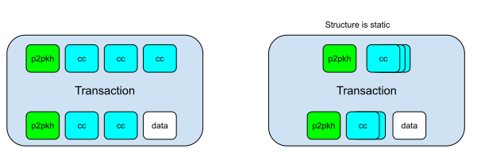

# PYCC

PYCC is a Python library for implementing Crypto-Conditions for the Komodo blockchain.

It's like a Django Web Framework for CC.

## Concepts

In PYCC you declare a `schema` for a CC contract, and you get a set of functions to create and validate transactions.

PYCC apps can be plugged into the Komodo blockchain by building komodo with blockchain support (link TODO).

### Schema

The Schema is where you declare the structure of your CC app. A schema contains CC apps, which define transactions.

See an example of a [faucet app defined as a PYCC schema](pycc/examples/faucet.py).

### Consume and Produce

The Schema then gives you two functions: `consume` to turn a `tx` into `params` (while also validating the structure),
and `produce` to to create a `tx` from `params`.

During the on-chain validation, the transaction is consumed in order to validate it's structure, and the business logic is performed on the resulting params rather than the TX itself.

```
                             Consume (also validates)

                           +-------------------------->


      +--------------------+                          +--------------------+
      |                    |                          |                    |
      |    Tx Binary       |                          |     Tx Params      |
      |                    |                          |                    |
      +--------------------+                          +--------------------+

                           <--------------------------+

                               Produce Tx from Params
```

### Tx deconstruction

PYCC conceptualizes transactions as function calls, that have many parameters and a tuple of outputs.

The number of inputs and outputs may vary, but the structure is static. When a variable number of inputs
is required, that is encoded as a list of inputs, so the structure does not change.



## Setup

Install [hoek](https://github.com/ssadler/hoek)

```shell
virtualenv -p python3 .env
.env/bin/activate
pip install -r requirements_test.txt
```

To run tests:

```
pytest
```
